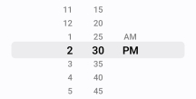
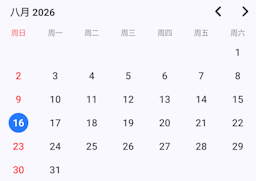
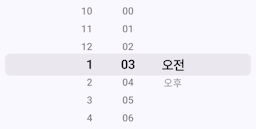

# ComposeDatePicker
An Android Jetpack Compose library that provides a Composable Date Picker / Time Picker functionality.
This is a fork of [vsnappy1/ComposeDatePicker](https://github.com/vsnappy1/composedatepicker)

[](https://central.sonatype.com/artifact/io.github.rexmtorres.android/composedatepicker)

## Dependencies Setup
```kotlin
dependencies {
    //..
    implementation("io.github.rexmtorres.android:composedatepicker:1.0.3")
}
```

## Usage
Adding a date picker or time picker is incredibly easy, requiring just two lines of code.

```kotlin
DatePicker(
    onDateSelected = { year, month, day ->
    
    }
)
```


```kotlin
TimePicker(
    onTimeSelected = { hour, minute ->

    }
)
```




## Customization
The date and time picker offer extensive customization options, allowing users to modify the 
TextStyle, Color, Size, Shape, and other elements to align with their preferred theme.

### Date Picker
___
#### Set Custom Date

```kotlin
import java.util.Calendar

DatePicker(
    onDateSelected = { year, month, day ->

    },
    date = DatePickerDate(
        year = 2023,
        month = Calendar.JANUARY,
        day = 5
    )
)
```
Please note that the **_year_** should be within a range of <current_year> ± 100 (inclusive). Additionally, for the **_month_**, 
please keep in mind that 0 represents January, while 11 corresponds to December.  It is better to use the `java.util.Calendar` month constants (e.g.: `Calendar.JANUARY`, `Calendar.DECEMBER`) to specify the month.

#### Set Selection Limit

```kotlin
import java.util.Calendar

DatePicker(
    onDateSelected = { year, month, day ->

    },
    selectionLimiter = SelectionLimiter(
        fromDate = DatePickerDate(
            year = 2023,
            month = Calendar.APRIL,
            day = 7
        ),
        toDate = DatePickerDate(
            year = 2023,
            month = Calendar.MAY,
            day = 21
        )
    )
)
```

#### Customize the Appearance
```kotlin
DatePicker(
    modifier = Modifier.padding(16.dp),
    onDateSelected = { year, month, day ->

    },
    configuration = DatePickerConfiguration.Builder()
        .height(height = 300.dp)
        .dateTextStyle(DefaultDatePickerConfig.dateTextStyle.copy(color = Color(0xFF333333)))
        .selectedDateTextStyle(textStyle = TextStyle(Color(0xFFFFFFFF)))
        .selectedDateBackgroundColor(color = Color(0xFF64DD17))
        .build()
)
```
In addition to **_dateTextStyle_**, **_selectedDateTextStyle_**, and **_selectedDateBackgroundColor_**, there are a total of 
20 attributes available for users to customize the appearance of the date picker.

#### Set the Locale
```kotlin
import java.util.Locale

DatePicker(
    locale = Locale.CHINESE,
    onDateSelected = { year, month, day ->

    },
)
```


<br>

### Time Picker
___
#### Set Custom Time
```kotlin
TimePicker(
    onTimeSelected = { hour, minute ->

    },
    time = TimePickerTime(
        hour = 12,
        minute = 45
    )
)
```

#### Set Is24Hour & MinuteGap
```kotlin
TimePicker(
    onTimeSelected = { hour, minute ->

    },
    is24Hour = true,
    minuteGap = MinuteGap.FIVE
)
```
The interval between consecutive items in the minute list is determined by the **_minuteGap_** parameter. When minuteGap is set to MinuteGap.FIVE, the minutes in the time picker will be displayed in increments of 5, such as 00, 05, 10,..., 55. The default value for minuteGap is MinuteGap.ONE, which means the minutes will be displayed in sequential order from 00 to 59.


#### Customize the Appearance
```kotlin
TimePicker(
    modifier = Modifier
        .padding(16.dp)
        .background(Color(0xFF1B5E20), RoundedCornerShape(8.dp)),
    onTimeSelected = { hour, minute ->

    },
    configuration = TimePickerConfiguration.Builder()
        .numberOfTimeRowsDisplayed(count = 5)
        .selectedTimeScaleFactor(scaleFactor = 1.4f)
        .build()
)
```
There are a total of 8 attributes available for users to customize the appearance of the time picker.

#### Set the Locale
```kotlin
import java.util.Locale

TimePicker(
    locale = Locale.KOREAN,
    onTimeSelected = { hour, minute ->

    },
)
```



## Utility Extensions

[DatePickerDate](https://html-preview.github.io/?url=https://github.com/rexmtorres/ComposeDatePicker/blob/main/doc/dokka/compose-date-picker/io.github.rexmtorres.android.composedatepicker.datepicker.data.model/-date-picker-date/index.html) and [TimePickerTime](https://html-preview.github.io/?url=https://github.com/rexmtorres/ComposeDatePicker/blob/main/doc/dokka/compose-date-picker/io.github.rexmtorres.android.composedatepicker.timepicker.data.model/-time-picker-time/index.html) have several extension functions to convert between [Date](https://developer.android.com/reference/kotlin/java/util/Date.html), [Calendar](https://developer.android.com/reference/kotlin/java/util/Calendar.html) and [Long](https://kotlinlang.org/api/latest/jvm/stdlib/kotlin/-long/index.html) (date/time representation in milliseconds).  There are also extension functions to add days/months/years to a DatePickerDate instance as well as add minutes/hours to a TimePickerTime instance.

* [DatePickerDate](https://html-preview.github.io/?url=https://github.com/rexmtorres/ComposeDatePicker/blob/main/doc/dokka/compose-date-picker/io.github.rexmtorres.android.composedatepicker.datepicker.data.model/-date-picker-date/index.html) extension functions:
  - [addDays](https://html-preview.github.io/?url=https://github.com/rexmtorres/ComposeDatePicker/blob/main/doc/dokka/compose-date-picker/io.github.rexmtorres.android.composedatepicker.datepicker.data.model/add-days.html)
  - [addMonths](https://html-preview.github.io/?url=https://github.com/rexmtorres/ComposeDatePicker/blob/main/doc/dokka/compose-date-picker/io.github.rexmtorres.android.composedatepicker.datepicker.data.model/add-months.html)
  - [millisToDatePickerDate](https://html-preview.github.io/?url=https://github.com/rexmtorres/ComposeDatePicker/blob/main/doc/dokka/compose-date-picker/io.github.rexmtorres.android.composedatepicker.datepicker.data.model/millis-to-date-picker-date.html)
  - [toCalendar](https://html-preview.github.io/?url=https://github.com/rexmtorres/ComposeDatePicker/blob/main/doc/dokka/compose-date-picker/io.github.rexmtorres.android.composedatepicker.datepicker.data.model/to-calendar.html)
  - [toDate](https://html-preview.github.io/?url=https://github.com/rexmtorres/ComposeDatePicker/blob/main/doc/dokka/compose-date-picker/io.github.rexmtorres.android.composedatepicker.datepicker.data.model/to-date.html)
  - [toDatePickerDate](https://html-preview.github.io/?url=https://github.com/rexmtorres/ComposeDatePicker/blob/main/doc/dokka/compose-date-picker/io.github.rexmtorres.android.composedatepicker.datepicker.data.model/to-date-picker-date.html)
  - [toMillis](https://html-preview.github.io/?url=https://github.com/rexmtorres/ComposeDatePicker/blob/main/doc/dokka/compose-date-picker/io.github.rexmtorres.android.composedatepicker.datepicker.data.model/to-millis.html)

* [TimePickerTime](https://html-preview.github.io/?url=https://github.com/rexmtorres/ComposeDatePicker/blob/main/doc/dokka/compose-date-picker/io.github.rexmtorres.android.composedatepicker.timepicker.data.model/-time-picker-time/index.html) extension functions:
  - [addHours](https://html-preview.github.io/?url=https://github.com/rexmtorres/ComposeDatePicker/blob/main/doc/dokka/compose-date-picker/io.github.rexmtorres.android.composedatepicker.timepicker.data.model/add-hours.html)
  - [addMinutes](https://html-preview.github.io/?url=https://github.com/rexmtorres/ComposeDatePicker/blob/main/doc/dokka/compose-date-picker/io.github.rexmtorres.android.composedatepicker.timepicker.data.model/add-minutes.html)
  - [millisToTimePickerTime](https://html-preview.github.io/?url=https://github.com/rexmtorres/ComposeDatePicker/blob/main/doc/dokka/compose-date-picker/io.github.rexmtorres.android.composedatepicker.timepicker.data.model/millis-to-time-picker-time.html)
  - [toCalendar](https://html-preview.github.io/?url=https://github.com/rexmtorres/ComposeDatePicker/blob/main/doc/dokka/compose-date-picker/io.github.rexmtorres.android.composedatepicker.timepicker.data.model/to-calendar.html)
  - [toDate](https://html-preview.github.io/?url=https://github.com/rexmtorres/ComposeDatePicker/blob/main/doc/dokka/compose-date-picker/io.github.rexmtorres.android.composedatepicker.timepicker.data.model/to-date.html)
  - [toMillis](https://html-preview.github.io/?url=https://github.com/rexmtorres/ComposeDatePicker/blob/main/doc/dokka/compose-date-picker/io.github.rexmtorres.android.composedatepicker.timepicker.data.model/to-millis.html)
  - [toTimePickerTime](https://html-preview.github.io/?url=https://github.com/rexmtorres/ComposeDatePicker/blob/main/doc/dokka/compose-date-picker/io.github.rexmtorres.android.composedatepicker.timepicker.data.model/to-time-picker-time.html)

Please refer to the full [documentation here](https://html-preview.github.io/?url=https://github.com/rexmtorres/ComposeDatePicker/blob/main/doc/dokka/index.html).


## Troubleshot

* If multiple date/time pickers are used, a unique **_id_** parameter should be included in the function call for each composable.

* When adjusting the height of a date/time picker, it is recommended to use [**_DatePickerConfiguration.Builder().height()_**](https://html-preview.github.io/?url=https://github.com/rexmtorres/ComposeDatePicker/blob/main/doc/dokka/compose-date-picker/io.github.rexmtorres.android.composedatepicker.datepicker.ui.model/-date-picker-configuration/-builder/height.html) and [**_TimePickerConfiguration.Builder().height()_**](https://html-preview.github.io/?url=https://github.com/rexmtorres/ComposeDatePicker/blob/main/doc/dokka/compose-date-picker/io.github.rexmtorres.android.composedatepicker.timepicker.ui.model/-time-picker-configuration/-builder/height.html) instead of **_Modifier.height()_** to ensure smooth rendering.
